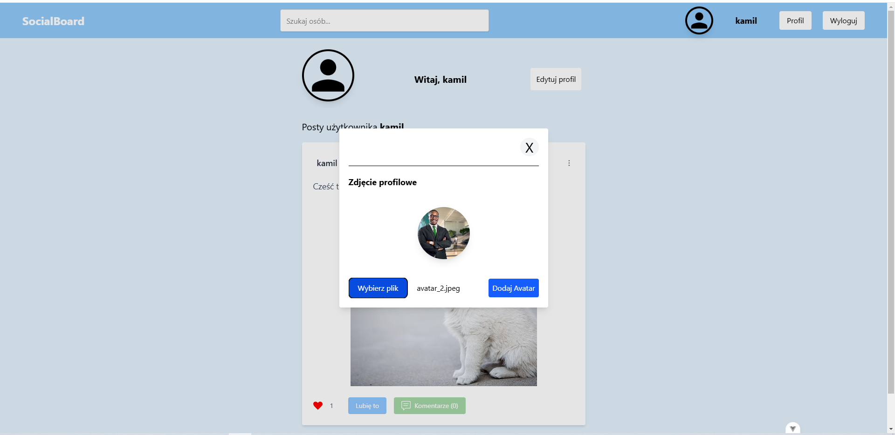
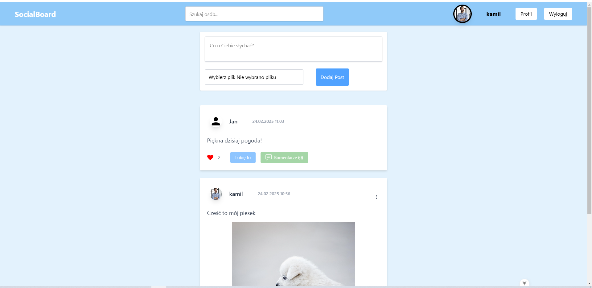
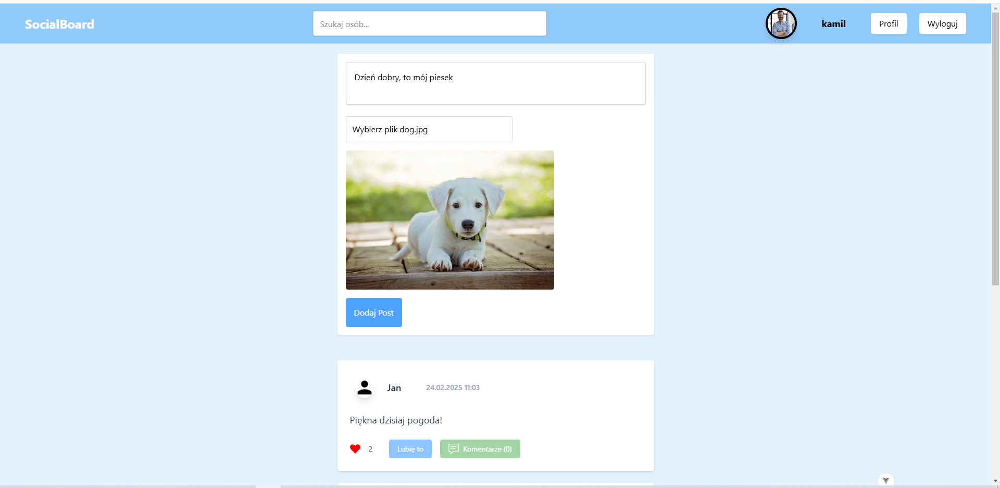
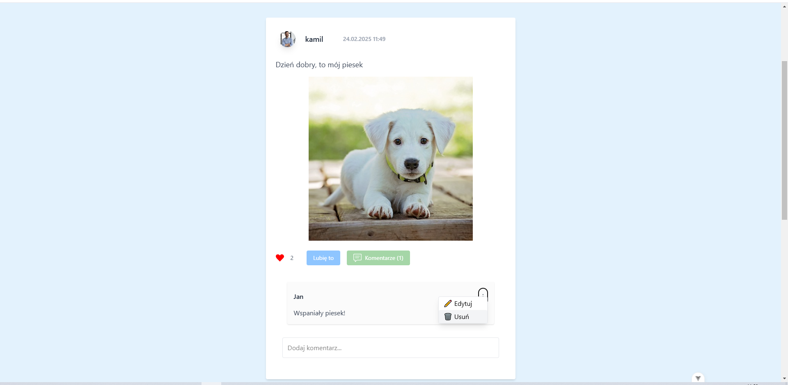
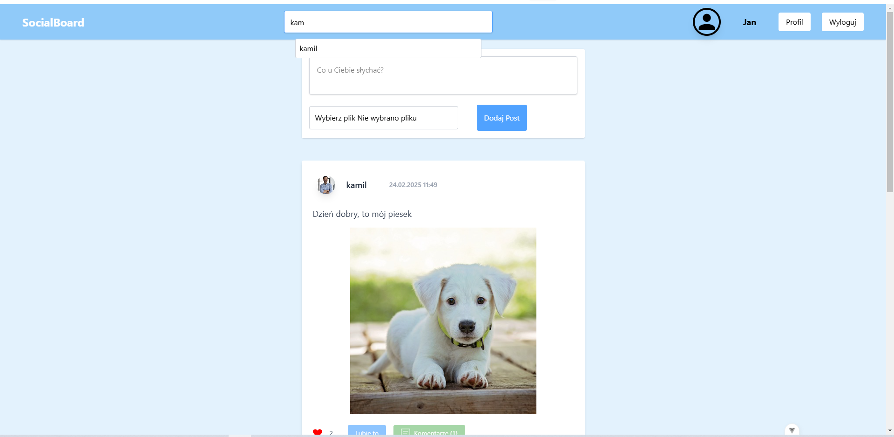
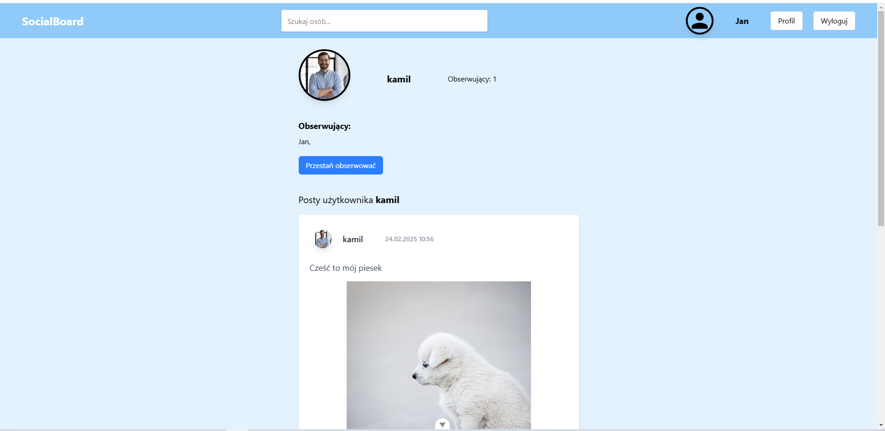

# Social Board

Aplikacja typu tablica umożliwiająca użytkownikom rejestrację, logowanie, dodawanie postów ze zdjęciami, komentarzy oraz interakcję poprzez "łapki w górę". Użytkownicy mogą edytować i usuwać tylko swoje posty oraz komentarze. Dodatkowo użytkownicy mogą obserwować innych (follow) i przestać ich obserwować (unfollow).

<div style="display: flex; justify-content: space-between;">
    
    
    
    
    
    
</div>

## Funkcjonalności

- **Rejestracja i logowanie** – użytkownicy mogą się zarejestrować i zalogować.
- **Posty** – użytkownicy mogą dodawać posty z treścią i zdjęciem oraz edytować i usuwać je, ale tylko twórca posta ma do tego prawo.
- **Edytowanie i usuwanie postów** – tylko twórca posta może edytować lub usunąć swój post.
- **Komentarze** – użytkownicy mogą dodawać komentarze do postów oraz edytować i usuwać je, ale tylko twórca komentarza ma do tego prawo.
- **Łapki w górę** – użytkownicy mogą "lajkować" posty.
- **Zdjęcie profilowe** – każdy użytkownik może dodać lub zmienić swoje zdjęcie profilowe.
- **Follow / Unfollow** – użytkownicy mogą obserwować innych użytkowników oraz przestać ich obserwować.
- **Lista obserwowanych i obserwujących** – użytkownicy mogą zobaczyć, kogo obserwują oraz kto ich obserwuje.

## Technologie

- **Frontend**: Vue.js, Vuex, TailwindCSS
- **Backend**: Express.js
- **Baza danych**: PostgreSQL

## Instalacja

1. **Klonowanie repozytorium**
   Aby sklonować repozytorium, użyj polecenia:
   ```bash
   git clone https://github.com/TwojaNazwaUzytkownika/tablica-postow.git
2. **Instalacja zależności**
Przejdź do katalogów frontend i backend i zainstaluj wymagane zależności:
3. **Frontend (Vue):**
   ```bash
    cd frontend
    npm install
   
4. **Backend (Express):**
   ```bash
    cd backend
    npm install
  
5. **Konfiguracja bazy danych**

Skonfiguruj PostgreSQL, utwórz bazę danych i połącz ją z aplikacją, edytując odpowiednie ustawienia w plikach konfiguracyjnych backendu.

6 .**Uruchomienie aplikacji**

- Frontend:

   ```bash
    cd frontend
    npm run serve

- Backend:

   ```bash
    cd backend
    npm run start
Aplikacja będzie dostępna pod adresem http://localhost:8080 dla frontendu i http://localhost:3000 dla backendu (lub zgodnie z ustawieniami).

7. **Licencja**
MIT
